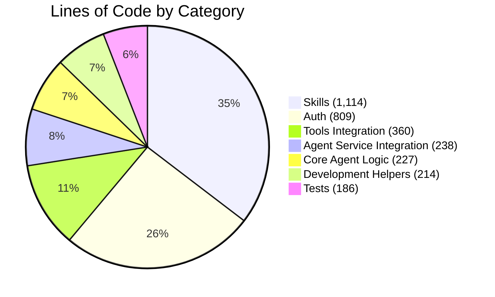
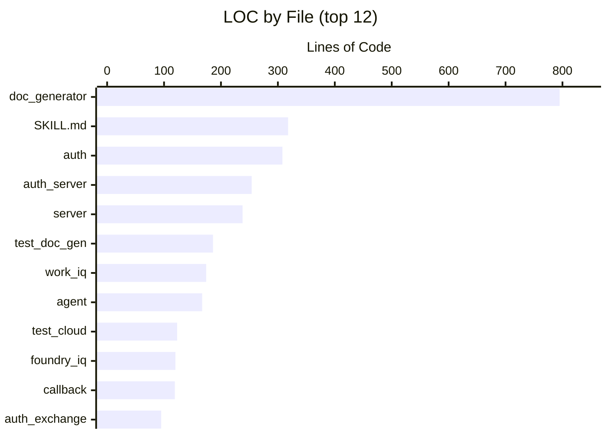
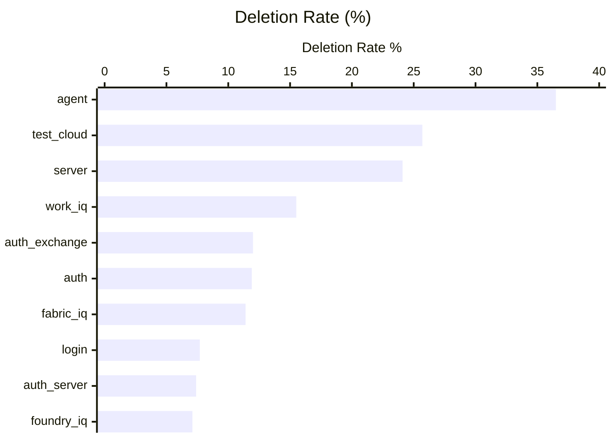
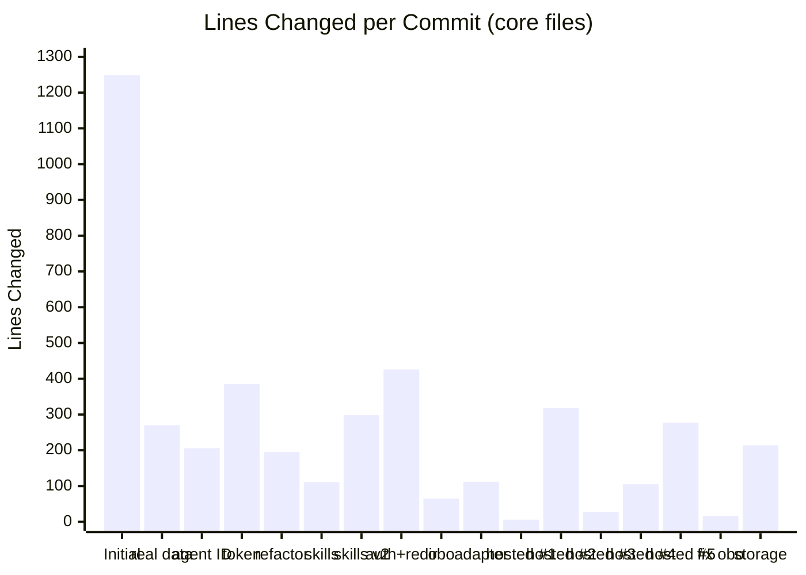

# sales-pres-demo — Code Analysis Report

> **3,148** Lines of Code &nbsp;|&nbsp; **18** Core Files &nbsp;|&nbsp; **17** Commits touching core &nbsp;|&nbsp; **2-Day** Sprint

*Core logic only — excludes seed scripts, provisioning scripts, mock data, and .gitignored files.*

---

## Code Composition

Breakdown of the codebase by functional category.

| Category | Files | LOC | % |
|----------|------:|----:|--:|
| Skills | 3 | 1,114 | 35.4% |
| Auth | 5 | 809 | 25.7% |
| Tools Integration | 4 | 360 | 11.4% |
| Agent Service Integration | 1 | 238 | 7.6% |
| Core Agent Logic | 2 | 227 | 7.2% |
| Development Helpers | 2 | 214 | 6.8% |
| Tests | 1 | 186 | 5.9% |

---

## Lines of Code by File

Top 12 files by size (of 18 total core files).

All files

| File | Category | LOC |
|------|----------|----:|
| `src/tools/doc_generator.py` | Skills | 795 |
| `src/skills/presentation/SKILL.md` | Skills | 318 |
| `src/auth.py` | Auth | 308 |
| `scripts/auth_server.py` | Auth | 254 |
| `src/server.py` | Agent Service Integration | 238 |
| `tests/test_doc_generator.py` | Tests | 186 |
| `src/tools/work_iq.py` | Tools Integration | 174 |
| `src/agent.py` | Core Agent Logic | 167 |
| `test_cloud.py` | Development Helpers | 123 |
| `src/tools/foundry_iq.py` | Tools Integration | 120 |
| `functions/callback/__init__.py` | Auth | 119 |
| `functions/shared/auth_exchange.py` | Auth | 95 |
| `src/invoke.py` | Development Helpers | 91 |
| `src/config.py` | Core Agent Logic | 60 |
| `src/tools/fabric_iq.py` | Tools Integration | 54 |
| `functions/login/__init__.py` | Auth | 33 |
| `src/tools/__init__.py` | Tools Integration | 12 |
| `src/skills/__init__.py` | Skills | 1 |

---

## Git Effort Map

How much each file was touched and reworked across the sprint. Higher effort = more commits and lines churned.

| File | Commits | Lines Added | Lines Deleted | Effort |
|------|--------:|------------:|--------------:|--------|
| `src/tools/doc_generator.py` | 3 | 803 | 8 | `██████████████████████████████` |
| `src/agent.py` | 8 | 392 | 225 | `██████████████████████████` |
| `src/server.py` | 4 | 349 | 111 | `████████████████████` |
| `src/auth.py` | 6 | 356 | 48 | `█████████████████` |
| `src/skills/presentation/SKILL.md` | 2 | 328 | 10 | `██████████████` |
| `scripts/auth_server.py` | 3 | 276 | 22 | `████████████` |
| `test_cloud.py` | 5 | 188 | 65 | `██████████` |
| `src/tools/work_iq.py` | 5 | 213 | 39 | `██████████` |
| `src/tools/foundry_iq.py` | 3 | 130 | 10 | `██████` |
| `functions/shared/auth_exchange.py` | 2 | 110 | 15 | `█████` |

> **Key insight:** `src/agent.py` was the most actively iterated file — 8 commits with 225 lines deleted (36.5% deletion rate), reflecting significant design exploration as the agent framework evolved. `src/server.py` similarly saw heavy rework (4 commits, 24.1% deletion rate) during the hosted-agent integration phase.

---

## Iteration Intensity

Deletion rate = lines deleted / (lines added + deleted). Higher values indicate more rework and design exploration.

| File | Added | Deleted | Deletion Rate | |
|------|------:|--------:|--------------:|---|
| `src/agent.py` | 392 | 225 | **36.5%** | `███████████████` |
| `test_cloud.py` | 188 | 65 | **25.7%** | `██████████` |
| `src/server.py` | 349 | 111 | **24.1%** | `██████████` |
| `src/tools/work_iq.py` | 213 | 39 | **15.5%** | `██████` |
| `functions/shared/auth_exchange.py` | 110 | 15 | **12.0%** | `█████` |
| `src/auth.py` | 356 | 48 | **11.9%** | `█████` |
| `src/tools/fabric_iq.py` | 62 | 8 | **11.4%** | `█████` |
| `functions/login/__init__.py` | 36 | 3 | **7.7%** | `███` |
| `scripts/auth_server.py` | 276 | 22 | **7.4%** | `███` |
| `src/tools/foundry_iq.py` | 130 | 10 | **7.1%** | `███` |

> **What high deletion rates mean:** `src/agent.py` (36.5%) underwent major structural changes — the agent orchestration was rewritten during the Copilot CLI refactor and again during hosted-agent integration. `test_cloud.py` (25.7%) evolved alongside `server.py` as the hosted deployment was iterated on. `src/server.py` (24.1%) was heavily reworked when migrating from local to hosted agent framework.

---

## Development Timeline

Lines changed (added + deleted) per commit, filtered to the 18 core files only.

| # | Date | Commit Message | Lines Changed |
|--:|------|----------------|-----:|
| 1 | Feb 24 11:23 | Initial commit: customer-facing sales presentation generator | 1,249 |
| 2 | Feb 24 12:58 | switching to real data | 270 |
| 3 | Feb 24 15:19 | agent ID with fallback | 206 |
| 4 | Feb 24 15:31 | asking it to use token | 385 |
| 5 | Feb 24 16:07 | **refactor to GitHub Copilot CLI** | 195 |
| 6 | Feb 24 16:19 | adding skills | 111 |
| 7 | Feb 24 16:29 | added skills (focused) | 298 |
| 8 | Feb 24 21:16 | **added auth and redirect function** | 426 |
| — | *overnight* | | |
| 9 | Feb 25 10:34 | got obo working | 65 |
| 10 | Feb 25 12:11 | adding agent framework adapter for hosted | 112 |
| 11 | Feb 25 14:28 | trying to get hosted agents working | 6 |
| 12 | Feb 25 15:38 | trying to get hosted to work | 318 |
| 13 | Feb 25 15:57 | maybe working now? | 28 |
| 14 | Feb 25 18:10 | still fighting hosted agents | 105 |
| 15 | Feb 25 18:41 | **got it working in hosted** | 277 |
| 16 | Feb 25 18:56 | trying to fix obo auth | 17 |
| 17 | Feb 25 19:53 | adding storage integration for urls | 214 |

> **Day 1** (commits 1–8): Core agent built, integrated with real data, refactored to Copilot CLI, skills added, and auth flow implemented — 3,140 lines changed.
> **Day 2** (commits 9–17): Focused on hosted deployment — 6 commits fighting hosted agents before finally landing it, then OBO auth fix and storage integration — 1,142 lines changed.

---

## File Summary

Complete table with category, LOC, and git statistics for all 18 core files.

| File | Category | LOC | Commits | Added | Deleted | Del Rate |
|------|----------|----:|--------:|------:|--------:|---------:|
| `src/tools/doc_generator.py` | Skills | 795 | 3 | 803 | 8 | 1.0% |
| `src/skills/presentation/SKILL.md` | Skills | 318 | 2 | 328 | 10 | 3.0% |
| `src/auth.py` | Auth | 308 | 6 | 356 | 48 | 11.9% |
| `scripts/auth_server.py` | Auth | 254 | 3 | 276 | 22 | 7.4% |
| `src/server.py` | Agent Service Integration | 238 | 4 | 349 | 111 | 24.1% |
| `tests/test_doc_generator.py` | Tests | 186 | 1 | 186 | 0 | 0.0% |
| `src/tools/work_iq.py` | Tools Integration | 174 | 5 | 213 | 39 | 15.5% |
| `src/agent.py` | Core Agent Logic | 167 | 8 | 392 | 225 | 36.5% |
| `test_cloud.py` | Development Helpers | 123 | 5 | 188 | 65 | 25.7% |
| `src/tools/foundry_iq.py` | Tools Integration | 120 | 3 | 130 | 10 | 7.1% |
| `functions/callback/__init__.py` | Auth | 119 | 2 | 121 | 2 | 1.6% |
| `functions/shared/auth_exchange.py` | Auth | 95 | 2 | 110 | 15 | 12.0% |
| `src/invoke.py` | Development Helpers | 91 | 1 | 91 | 0 | 0.0% |
| `src/config.py` | Core Agent Logic | 60 | 6 | 61 | 1 | 1.6% |
| `src/tools/fabric_iq.py` | Tools Integration | 54 | 3 | 62 | 8 | 11.4% |
| `functions/login/__init__.py` | Auth | 33 | 2 | 36 | 3 | 7.7% |
| `src/tools/__init__.py` | Tools Integration | 12 | 1 | 12 | 0 | 0.0% |
| `src/skills/__init__.py` | Skills | 1 | 1 | 1 | 0 | 0.0% |
