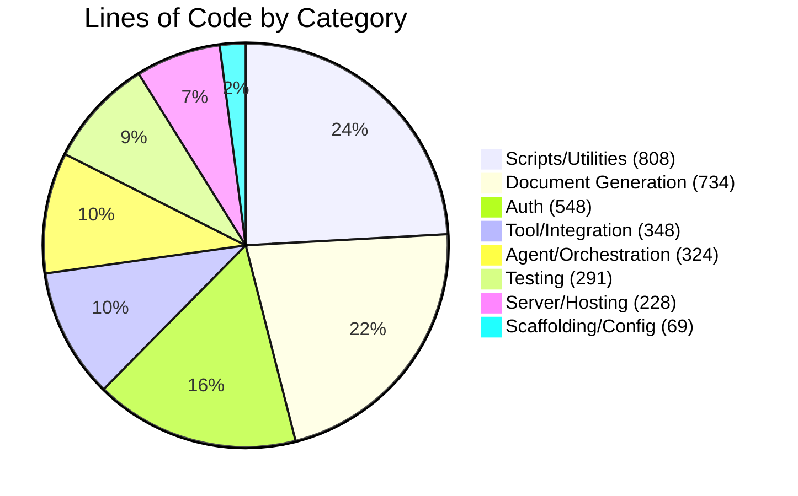
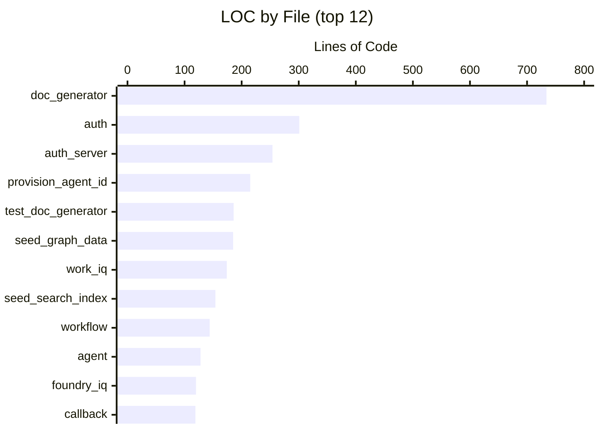
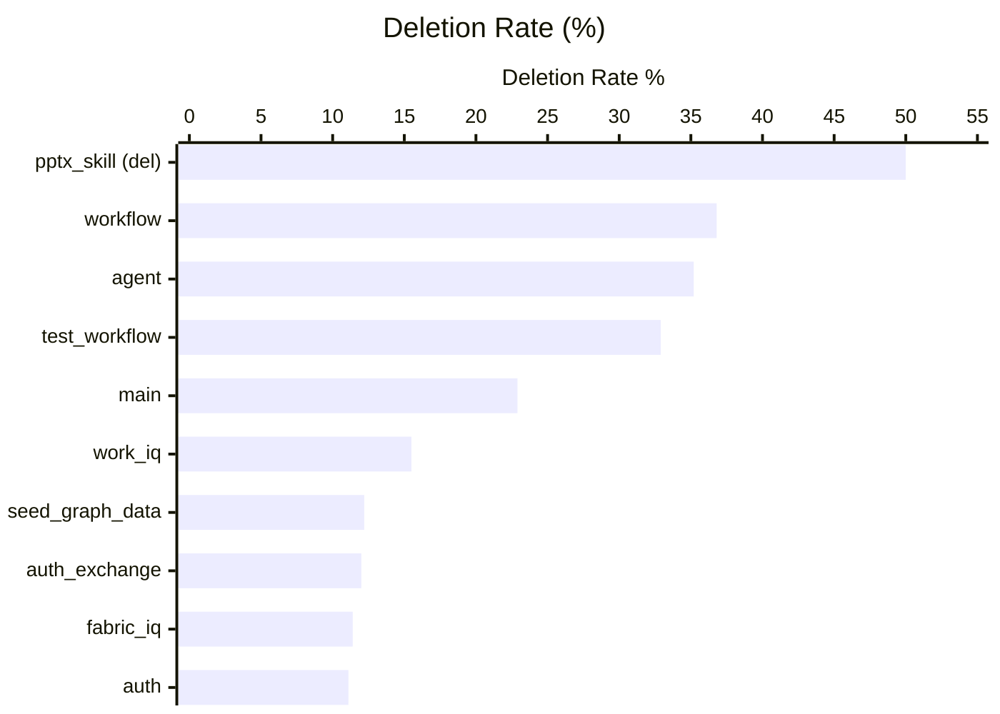
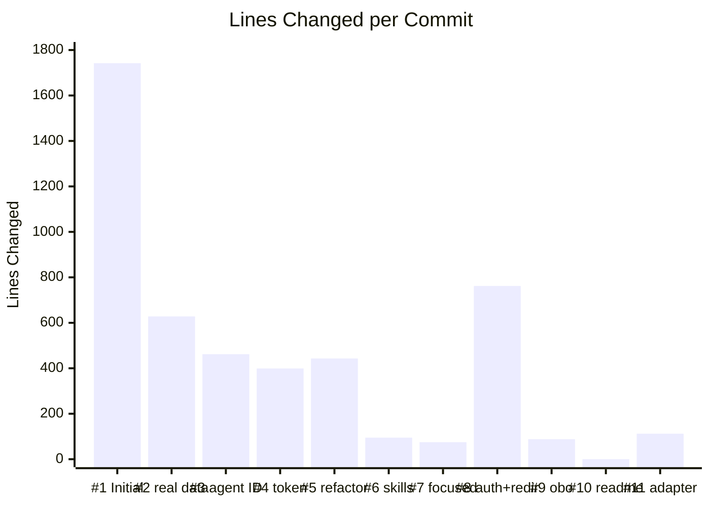

# sales-pres-demo — Code Analysis Report

> **3,350** Lines of Code &nbsp;|&nbsp; **23** Python Files &nbsp;|&nbsp; **11** Commits &nbsp;|&nbsp; **2-Day** Sprint

---

## Code Composition

Breakdown of the codebase by functional category.

| Category | LOC | % |
|----------|----:|--:|
| Scripts/Utilities | 808 | 24.1% |
| Document Generation | 734 | 21.9% |
| Auth | 548 | 16.4% |
| Tool/Integration | 348 | 10.4% |
| Agent/Orchestration | 324 | 9.7% |
| Testing | 291 | 8.7% |
| Server/Hosting | 228 | 6.8% |
| Scaffolding/Config | 69 | 2.1% |

---

## Lines of Code by File

Top 12 files by size (of 23 total non-empty Python files).

All files

| File | Category | LOC |
|------|----------|----:|
| `src/tools/doc_generator.py` | Document Generation | 734 |
| `src/auth.py` | Auth | 301 |
| `scripts/auth_server.py` | Scripts/Utilities | 254 |
| `scripts/provision_agent_id.py` | Scripts/Utilities | 215 |
| `tests/test_doc_generator.py` | Testing | 186 |
| `scripts/seed_graph_data.py` | Scripts/Utilities | 185 |
| `src/tools/work_iq.py` | Tool/Integration | 174 |
| `scripts/seed_search_index.py` | Scripts/Utilities | 154 |
| `src/workflow.py` | Agent/Orchestration | 144 |
| `src/agent.py` | Agent/Orchestration | 128 |
| `src/tools/foundry_iq.py` | Tool/Integration | 120 |
| `functions/callback/__init__.py` | Auth | 119 |
| `src/teams_host.py` | Server/Hosting | 116 |
| `tests/test_workflow.py` | Testing | 105 |
| `functions/shared/auth_exchange.py` | Auth | 95 |
| `src/invoke.py` | Server/Hosting | 91 |
| `src/config.py` | Scaffolding/Config | 56 |
| `src/tools/fabric_iq.py` | Tool/Integration | 54 |
| `src/main.py` | Agent/Orchestration | 52 |
| `functions/login/__init__.py` | Auth | 33 |
| `src/server.py` | Server/Hosting | 21 |
| `src/tools/__init__.py` | Scaffolding/Config | 12 |
| `src/skills/__init__.py` | Scaffolding/Config | 1 |

---

## Git Effort Map

How much each file was touched and reworked across the sprint. Files in the upper-right with large markers are the highest-effort files.

| File | Commits | Lines Added | Lines Deleted | Effort |
|------|--------:|------------:|--------------:|--------|
| `src/workflow.py` | 4 | 344 | 200 | `██████████████████████████████` |
| `src/agent.py` | 5 | 280 | 152 | `████████████████████████` |
| `src/auth.py` | 5 | 344 | 43 | `█████████████████████` |
| `src/tools/work_iq.py` | 5 | 213 | 39 | `██████████████` |
| `tests/test_workflow.py` | 5 | 206 | 101 | `█████████████████` |
| `src/tools/doc_generator.py` | 2 | 739 | 5 | `██████████████████████████` |
| `scripts/auth_server.py` | 3 | 276 | 22 | `████████████████` |
| `scripts/seed_graph_data.py` | 2 | 215 | 30 | `█████████████` |
| `src/tools/foundry_iq.py` | 3 | 130 | 10 | `████████` |
| `src/main.py` | 3 | 74 | 22 | `█████` |

> **Key insight:** `src/workflow.py` and `src/agent.py` sit in the high-churn quadrant — both were touched in 4–5 commits with significant rework (200 and 152 lines deleted respectively). These files represent the core orchestration logic that evolved the most during the sprint.

---

## Iteration Intensity

Deletion rate = lines deleted / (lines added + deleted). Higher values indicate more rework and design exploration.

| File | Added | Deleted | Deletion Rate | |
|------|------:|--------:|--------------:|---|
| `src/skills/pptx_skill.py` *(deleted)* | 75 | 75 | **50.0%** | `████████████████████` |
| `src/workflow.py` | 344 | 200 | **36.8%** | `███████████████` |
| `src/agent.py` | 280 | 152 | **35.2%** | `██████████████` |
| `tests/test_workflow.py` | 206 | 101 | **32.9%** | `█████████████` |
| `src/main.py` | 74 | 22 | **22.9%** | `█████████` |
| `src/tools/work_iq.py` | 213 | 39 | **15.5%** | `██████` |
| `scripts/seed_graph_data.py` | 215 | 30 | **12.2%** | `█████` |
| `functions/shared/auth_exchange.py` | 110 | 15 | **12.0%** | `█████` |
| `src/tools/fabric_iq.py` | 62 | 8 | **11.4%** | `█████` |
| `src/auth.py` | 344 | 43 | **11.1%** | `████` |

> **What high deletion rates mean:** `pptx_skill.py` (50%) was ultimately deleted entirely in favor of a Markdown-based skill. `workflow.py` (36.8%) was heavily reworked during the Copilot CLI refactor and auth integration. `agent.py` (35.2%) underwent major structural changes as the agent framework evolved.

---

## Development Timeline

Lines changed (added + deleted) per commit, Python files only (excludes `uv.lock`).

| # | Date | Commit Message | Lines Changed |
|--:|------|----------------|-----:|
| 1 | Feb 24 11:23 | Initial commit: customer-facing sales presentation generator | 1,742 |
| 2 | Feb 24 12:58 | switching to real data | 628 |
| 3 | Feb 24 15:19 | agent ID with fallback | 462 |
| 4 | Feb 24 15:31 | asking it to use token | 399 |
| 5 | Feb 24 16:07 | **refactor to GitHub Copilot CLI** | 443 |
| 6 | Feb 24 16:19 | adding skills | 95 |
| 7 | Feb 24 16:29 | added skills (focused) | 75 |
| 8 | Feb 24 21:16 | **added auth and redirect function** | 762 |
| — | *overnight* | | |
| 9 | Feb 25 10:34 | got obo working | 88 |
| 10 | Feb 25 10:41 | adding readme | 0 |
| 11 | Feb 25 12:11 | adding agent framework adapter for hosted | 112 |

> **Commit 5** "refactor to GitHub Copilot CLI" — largest refactor, net −487 lines (incl. `uv.lock`)
> **Commit 8** "added auth and redirect function" — major feature addition, +259 net lines
> **Overnight gap** between Feb 24 evening and Feb 25 morning separates the two development phases.

---

## File Summary

Complete file-level breakdown with git statistics.

| File | Category | LOC | Commits | Added | Deleted | Del Rate |
|------|----------|----:|--------:|------:|--------:|---------:|
| `src/tools/doc_generator.py` | Document Generation | 734 | 2 | 739 | 5 | 0.7% |
| `src/auth.py` | Auth | 301 | 5 | 344 | 43 | 11.1% |
| `scripts/auth_server.py` | Scripts/Utilities | 254 | 3 | 276 | 22 | 7.4% |
| `scripts/provision_agent_id.py` | Scripts/Utilities | 215 | 1 | 215 | 0 | 0.0% |
| `tests/test_doc_generator.py` | Testing | 186 | 1 | 186 | 0 | 0.0% |
| `scripts/seed_graph_data.py` | Scripts/Utilities | 185 | 2 | 215 | 30 | 12.2% |
| `src/tools/work_iq.py` | Tool/Integration | 174 | 5 | 213 | 39 | 15.5% |
| `scripts/seed_search_index.py` | Scripts/Utilities | 154 | 1 | 154 | 0 | 0.0% |
| `src/workflow.py` | Agent/Orchestration | 144 | 4 | 344 | 200 | 36.8% |
| `src/agent.py` | Agent/Orchestration | 128 | 5 | 280 | 152 | 35.2% |
| `src/tools/foundry_iq.py` | Tool/Integration | 120 | 3 | 130 | 10 | 7.1% |
| `functions/callback/__init__.py` | Auth | 119 | 2 | 121 | 2 | 1.6% |
| `src/teams_host.py` | Server/Hosting | 116 | 1 | 116 | 0 | 0.0% |
| `tests/test_workflow.py` | Testing | 105 | 5 | 206 | 101 | 32.9% |
| `functions/shared/auth_exchange.py` | Auth | 95 | 2 | 110 | 15 | 12.0% |
| `src/invoke.py` | Server/Hosting | 91 | 1 | 91 | 0 | 0.0% |
| `src/config.py` | Scaffolding/Config | 56 | 5 | 57 | 1 | 1.7% |
| `src/tools/fabric_iq.py` | Tool/Integration | 54 | 3 | 62 | 8 | 11.4% |
| `src/main.py` | Agent/Orchestration | 52 | 3 | 74 | 22 | 22.9% |
| `functions/login/__init__.py` | Auth | 33 | 2 | 36 | 3 | 7.7% |
| `src/server.py` | Server/Hosting | 21 | 1 | 21 | 0 | 0.0% |
| `src/tools/__init__.py` | Scaffolding/Config | 12 | 1 | 12 | 0 | 0.0% |
| `src/skills/__init__.py` | Scaffolding/Config | 1 | 1 | 1 | 0 | 0.0% |
| *`src/skills/pptx_skill.py`* | *Document Generation* | *0 (deleted)* | *2* | *75* | *75* | *50.0%* |
